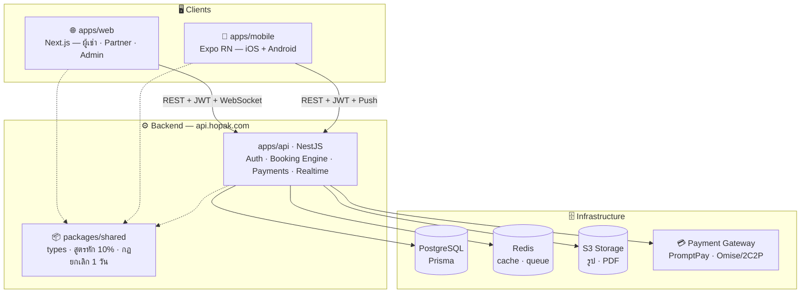
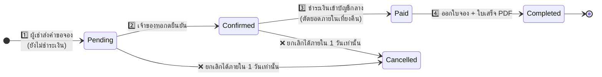

<div align="center">

# 🏠 Hopak

**แพลตฟอร์มค้นหา จอง และจัดการหอพักออนไลน์**

*ค้นหาง่าย · จองไว · จัดการครบ — สำหรับนักศึกษา เจ้าของหอ และแอดมิน ในระบบเดียว*

<br/>


<br/>

📱 iOS App · 🤖 Android App · 🌐 Web Application

</div>

---

## 📖 ภาพรวม

**Hopak** คือแพลตฟอร์มจองหอพักครบวงจร ออกแบบสำหรับตลาดนักศึกษาไทย (เริ่มที่ **มหาสารคาม · ขอนแก่น · เชียงใหม่**) ประกอบด้วย 3 แอปพลิเคชันที่ใช้ **บัญชีเดียว (SSO)** และ **Backend API กลางตัวเดียว** ร่วมกัน:

| แอป | ผู้ใช้ | แพลตฟอร์ม |
|:---|:---|:---|
| 🔵 **Hopak** | ผู้เช่า (นักศึกษา / คนทำงาน) | iOS · Android · Web |
| 🟢 **Hopak Partner** | เจ้าของหอพัก | Mobile + Web Console |
| 🟣 **Hopak Admin** | ผู้ดูแลระบบ | Web Console |

---

## 🏗️ สถาปัตยกรรม

> **หลักการ: API-first** — ทุกหน้าจอ (เว็บ + แอพ) ยิงเข้า Backend API กลางตัวเดียว · ฐานข้อมูลเดียว = Single Source of Truth



---

## 🔄 Flow การจอง (ลำดับตายตัว — ห้ามข้าม)



### 💰 เส้นทางการเงิน

```
ผู้เช่าชำระเงิน (มัดจำ + ล่วงหน้า)
        ↓
บัญชีส่วนกลาง Hopak  ──  ตัดยอดภายในเที่ยงคืน
        ↓
หักค่าบริการ 10%  =  รายได้ Hopak 💚
        ↓
โอนส่วนที่เหลือให้เจ้าของหอ + ออกใบยืนยันการชำระเงิน
```

---

## ⭐ ฟีเจอร์หลัก

<table>
<tr>
<td width="33%" valign="top">

### 🔵 ผู้เช่า
- 🔍 ค้นหาตามจังหวัด / พิกัด / มหาวิทยาลัย
- 🏠 ดูรายละเอียดหอ ราคา ค่าน้ำ-ไฟ แผนที่
- 📅 จองห้อง + ติดตามสถานะแบบ timeline
- 💳 ชำระเงินปลอดภัยผ่านบัญชีกลาง
- 🧾 ใบจอง + ใบเสร็จ PDF อัตโนมัติ
- 🔔 แจ้งเตือนสถานะ + โปรโมชัน

</td>
<td width="33%" valign="top">

### 🟢 เจ้าของหอ
- 🏢 เพิ่ม/แก้ไขหอเองได้ทันที ไม่ต้องรอแอดมิน
- 🛏️ จัดการห้อง — ตัดห้องเต็มอัตโนมัติ
- ⚡ คำขอจองเด้ง realtime → กดยืนยัน
- 🖨️ ใบจองรายวัน + ปริ้น PDF
- 📊 แดชบอร์ดรายได้ ยอดจอง กราฟรายเดือน
- 🏦 รับยอดโอนหลังหักค่าบริการ 10%

</td>
<td width="33%" valign="top">

### 🟣 แอดมิน
- 📈 แดชบอร์ดรายได้ระบบ + ยอดจองต่อจังหวัด
- ✅ คิวอนุมัติหอใหม่ (เอกสาร + พิกัด)
- 👥 จัดการผู้ใช้ / ระงับบัญชี
- 💸 การเงิน & รวมบิล + Export
- 📢 โฆษณา Boost / Banner / Featured
- 🔐 แบ่งสิทธิ์ Super Admin · Finance · Support

</td>
</tr>
</table>

---

## 🛡️ กฎธุรกิจสำคัญ (Business Rules)

| # | กฎ |
|:-:|:---|
| 1 | การจองต้องผ่านลำดับ: **ส่งคำขอ → เจ้าของยืนยัน → ชำระเงิน → ออกใบจอง** (ห้ามข้าม) |
| 2 | ยกเลิกฟรีได้ **ภายใน 1 วัน** หลังจอง — หลังจากนั้นปุ่มยกเลิกถูกล็อก |
| 3 | หักค่าบริการ **10%** จากทุกยอดที่ชำระผ่านระบบ |
| 4 | เบอร์ผู้จอง**ซ่อนบางส่วน** (`089-123-**-*`) จนกว่าจะชำระเงินเสร็จ — กันการติดต่อนอกระบบ |
| 5 | เจ้าของหอแก้ไขข้อมูลเองได้ทันที (เฉพาะ**หอใหม่**ต้องรอแอดมินอนุมัติครั้งแรก) |
| 6 | เงินทุกบาทเข้า**บัญชีส่วนกลาง** ตัดยอดภายในเที่ยงคืน |

---

## 📁 โครงสร้าง Monorepo

```
hopak/
├── apps/
│   ├── api/          ⚙️  NestJS + Prisma — Backend กลาง (Booking Engine, Payments, Realtime)
│   ├── web/          🌐  Next.js — (tenant) / (partner) / (admin) route groups
│   └── mobile/       📱  Expo React Native — ผู้เช่า + Partner ในแอพเดียว
│
├── packages/
│   ├── shared/       📦  types · constants · business logic (หัก 10%, ยกเลิก 1 วัน — เขียนที่เดียว)
│   ├── ui/           🎨  shared React components
│   └── config/       🔧  eslint · tsconfig กลาง
│
├── docker/           🐳  docker-compose (PostgreSQL + Redis) สำหรับ dev
├── .github/          🤖  CI/CD workflows
├── turbo.json        ⚡  Turborepo pipeline
└── pnpm-workspace.yaml
```

> 📄 รายละเอียดเต็ม: [`Hopak-File-Structure.md`](./Hopak-File-Structure.md) · สรุปโปรเจกต์: [`Hopak-Project-Brief.md`](./Hopak-Project-Brief.md)

---

## 🚀 เริ่มต้นพัฒนา (Quick Start)

### สิ่งที่ต้องมี

- **Node.js** ≥ 20 · **pnpm** ≥ 9 · **Docker** (สำหรับ PostgreSQL + Redis)

### ติดตั้ง

```bash
# 1. Clone repo
git clone https://github.com/karshi02/Hopak.git
cd Hopak

# 2. ติดตั้ง dependencies ทั้ง monorepo
pnpm install

# 3. ตั้งค่า environment
cp .env.example .env        # แล้วเติมค่าให้ครบ

# 4. รัน PostgreSQL + Redis
docker compose -f docker/docker-compose.yml up -d

# 5. Migrate + Seed ฐานข้อมูล
pnpm db:migrate
pnpm db:seed

# 6. รันทุกแอปพร้อมกัน 🎉
pnpm dev
```

| Service | URL |
|:---|:---|
| 🌐 Web | `http://localhost:3000` |
| ⚙️ API | `http://localhost:3001` |
| 📱 Mobile | Expo Go — `pnpm --filter mobile dev` |

---

## 🧰 Tech Stack

| ชั้น | เทคโนโลยี |
|:---|:---|
| **Web** | Next.js (App Router) · TypeScript · Tailwind CSS |
| **Mobile** | React Native (Expo) · Expo Router — โค้ดชุดเดียว → iOS + Android |
| **Backend** | Node.js · NestJS · TypeScript |
| **API** | REST · JWT + SSO · WebSocket (realtime booking) |
| **Database** | PostgreSQL + Prisma ORM · Redis (cache/queue) |
| **Storage** | S3 / Object Storage (รูป, เอกสาร, PDF) |
| **Payment** | PromptPay · Omise / 2C2P |
| **Notification** | Expo Notifications (FCM + APNs) |
| **Monorepo** | pnpm workspaces + Turborepo |
| **Deploy** | Web → Vercel · API → Railway/Docker · App → EAS Build |

---

## 💼 โมเดลรายได้

| # | ช่องทาง | รายละเอียด |
|:-:|:---|:---|
| 1 | **ค่าคอมมิชชัน 10%** 🏆 | หักจากทุกการจองที่สำเร็จผ่านระบบ *(รายได้หลัก)* |
| 2 | ฟีดโปรโมท (Boost) | เจ้าของหอจ่ายเพื่อดันหอขึ้นฟีด |
| 3 | แพ็คโฆษณา | แบนเนอร์ในแอพ/เว็บ |
| 4 | แพ็คโปรโมชัน | ป้าย Featured / แนะนำ |
| 5 | ค่าบริการเพิ่มเติม | ฟีเจอร์เสริมสำหรับหอพัก |
| 6 | *(เฟสถัดไป)* GPA หอพัก | คะแนนความน่าเชื่อถือ ใช้จัดอันดับ |

---

## 🗺️ Roadmap

- [x] **Phase 0** — ออกแบบระบบ · UI ทุกหน้าจอ · โครงสร้าง Monorepo
- [ ] **Phase 1** — Backend API (NestJS + Prisma + PostgreSQL) + Admin Console
- [ ] **Phase 2** — เว็บผู้เช่า + Partner Console (Next.js)
- [ ] **Phase 3** — แอพมือถือ iOS/Android (Expo) + Push Notifications
- [ ] **Next** — รีวิว & คะแนนหอพัก · GPA ความน่าเชื่อถือ · ขยายจังหวัด

---

<div align="center">


</div>
